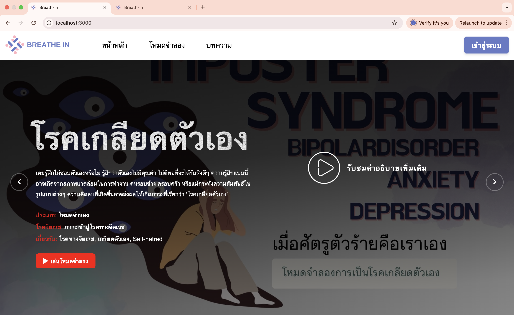

# 🌿 Breath In




**Breath In** is a website designed to raise awareness and improve understanding of mental health conditions.  
It aims to help both individuals facing mental health challenges and the people around them gain deeper insights.  

The website provides a **Simulation Mode** that reflects the experience and mental states of people living with psychiatric disorders.  
Additionally, it includes **mood tracking and evaluation features** to prevent users from feeling worse after engaging with the simulations.

---

## ✨ Key Features

### 🌀 Simulation Mode
- Offers immersive scenarios that reflect mental health experiences through **light, sound, and color effects**.  
- Helps users better understand the mental states of patients.

### 📊 Mood Tracking & Evaluation
- Records emotions **before and after** using the simulation mode.  
- Provides insights into the user’s current mental well-being.

### 💬 Counseling & Support
- Connects users with **clinics and psychiatrists**.  
- Promotes free consultation services for those in need.

### 🌍 Community Board
- An open space for users to **share experiences, talk, and seek advice**.  
- Encourages peer-to-peer mental health support.

---

## 🎥 Demo Video

[▶ Watch the Demo Video](https://o365cmu-my.sharepoint.com/:v:/g/personal/chadaporn_somon_cmu_ac_th/EQRwwsJoJb5KgWc8n9Jzm7MBqjwDW-zQv3YyznsiC1Ed4Q?nav=eyJyZWZlcnJhbEluZm8iOnsicmVmZXJyYWxBcHAiOiJPbmVEcml2ZUZvckJ1c2luZXNzIiwicmVmZXJyYWxBcHBQbGF0Zm9ybSI6IldlYiIsInJlZmVycmFsTW9kZSI6InZpZXciLCJyZWZlcnJhbFZpZXciOiJNeUZpbGVzTGlua0NvcHkifX0&e=JzhDP8)

---

## 🛠️ Installation & Usage

Clone the project:
```bash
git clone <repository-url>
cd breath-in
Install dependencies:
npm install
Run the project:
npm start
Open in your browser at:
http://localhost:3000
🎯 Project Goals
Reduce stigma and misconceptions about mental health conditions.
Raise awareness in society about people experiencing mental health challenges.
Promote access to accurate information, counseling, and proper mental health care.
📌 License
This project is developed for educational purposes and awareness only.
It is not a substitute for professional medical treatment.